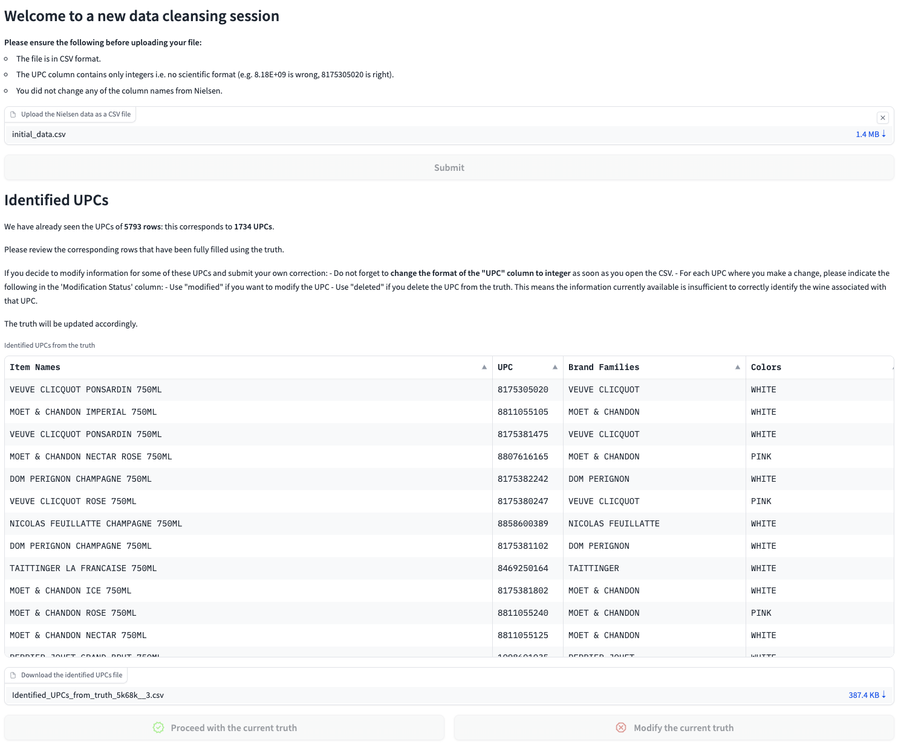

# Data cleansing app for a Champagne brand

## A few words about this project

Created an app hosted on HuggingFace to help a Champagne brand with their monthly data cleansing of Nielsen data.
The data cleansing now takes on average 15 minutes per month versus 3 days previously.
I have not shared the Nielsen data or the current_truth.csv file, but below is an example of a typical data cleansing session.

## Typical data cleansing session

